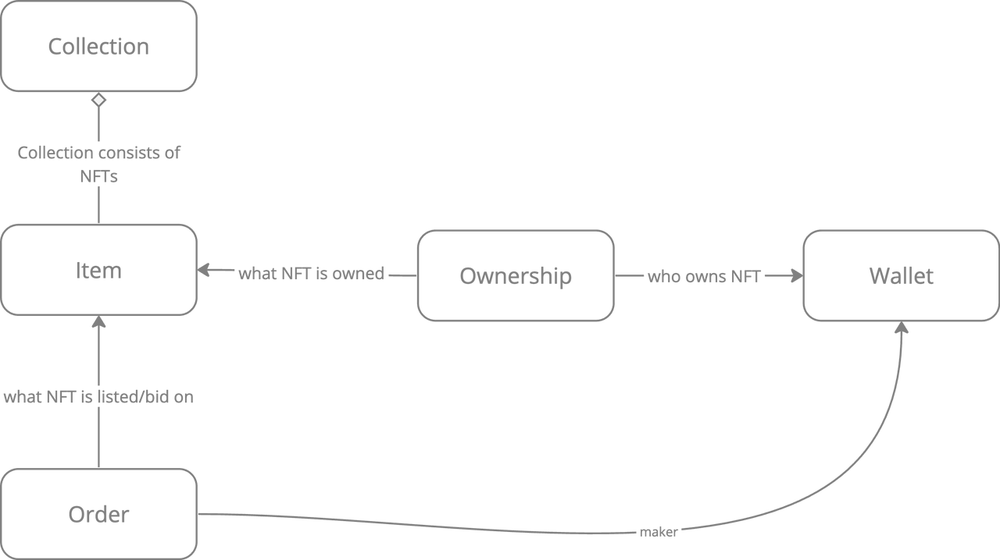

# EasySwap Hardhat Project

## 背景介绍
> 2020 年是 DeFi 元年 
> 2021 年是 NFT 元年

- 数字资产的兴起与需求
- 去中心化的市场需求
- 版权保护和二级市场
- 全球化市场的潜力
- 技术与金融的融合

## 项目意义
当前的 NFT 交易市场不仅是一个基于区块链的应用，也是链上技术与链下服务高度结合的典型范例。通过项目的设计和开发，可以探索如何将区块链的去中心化、透明性、不可篡改等特点与传统的链下业务流程进行有机融合，创建一个灵活、可扩展的系统架构，不仅服务于 NFT 交易市场，还能支持未来其他潜在的链上应用，如 Bitcoin 上的铭文、符文等新兴数字资产。以下从几个关键角度说明项目的深远意义：

- 技术架构的通用性和可扩展性
- 链上技术原理与链下服务的结合
- 去中心化应用的场景扩展
 
## NFT 基本概念


## NFT 的核心操作
详见：[Ethereum Improvement Proposals](https://eips.ethereum.org/EIPS/eip-721) 

ERC-721: Non-Fungible Token Standard
transfer
```solidity
safeTransferFrom(address _from, address _to, uint256 _tokenId)
transferFrom(address _from, address _to, uint256 _tokenId)
```

approve
```solidity
approve(address _approved, uint256 _tokenId)
setApprovalForAll(address _operator, bool _approved)
```
 
 
## NFT 数据模型
```
Collection ———— NFT 集合的实体

Item ———— 代表交易系统中代表 NFT 的实体

Ownership ———— 代表 NFT 的所有权，也就是 Item 的 Owner， 即 Item 和 Wallet 的关联关系

Order ———— 代表出售或购买 NFT 意愿的实体。

Activity ———— 代表 NFT 状态下发生的事件：mint, transfer, list, buy 等 
```



## NFT 交易模式
1. NFT 订单在链下: 非 dex
2. NFT 订单在链上:dex

**订单簿 OrderBook**: Maker, Taker: 用户; 价格确定于订单

**做市商 AMM**: ERC721——AMM: Maker, Taker: 一方是池子, 一方是用户; 价格是随池子变化的;

## 项目描述

### 架构图

#### API 服务


#### 交易同步服务


#### NFT 导入服务


#### 微服务功能描述


涉及 Collection，Item， Order， Activity 等实体的相关接口请求
```sql
create table ob_collection_sepolia
(
    id                 bigint auto_increment comment '主键'
        primary key,
    chain_id           tinyint    default 1 not null comment '链类型(1:以太坊)',
    symbol             varchar(128)         not null comment '项目标识',
    name               varchar(128)         not null comment '项目名称',
    creator            varchar(42)          not null comment '创建者',
    address            varchar(42)          not null comment '链上合约地址',
    owner_amount       bigint     default 0 not null comment '拥有item人数',
    item_amount        bigint     default 0 not null comment '该项目NFT的发行总量',
    floor_price        decimal(30)          null comment '整个collection中item的最低的listing价格',
    sale_price         decimal(30)          null comment '整个collection中bid的最高的价格',
    description        varchar(2048)        null comment '项目描述',
    website            varchar(512)         null comment '项目官网地址',
          /twitter...
    volume_total       decimal(30)          null comment '总交易量',
    image_uri          varchar(512)         null comment '项目封面图的链接',
    // is_need_refresh    tinyint    default 0 not null comment '是否需要刷新',
    create_time        bigint               null comment '创建时间',
    update_time        bigint               null comment '更新时间',
    constraint index_unique_address
        unique (address)
);

create table ob_item_sepolia
(
    id                 bigint auto_increment comment '主键'
        primary key,
    chain_id           tinyint      default 1                     not null comment '链类型',
    token_id           varchar(128)                               not null comment 'token_id',
    name               varchar(128)                               not null comment 'nft名称',
    owner              varchar(42)                                null comment '拥有者',
    collection_address varchar(42)                                null comment '合约地址',
    creator            varchar(42)                                not null comment '创建者',
    supply             bigint                                     not null comment 'item供应量',
    list_price         decimal(30)                                null comment '上架价格',
    list_time          bigint                                     null comment '上架时间',
    sale_price         decimal(30)                                null comment '上一次成交价格',
    create_time        bigint                                     null comment '创建时间',
    update_time        bigint                                     null comment '更新时间',
    constraint index_collection_token
        unique (collection_address, token_id)
);

create table ob_order_sepolia
(
    id                 bigint auto_increment comment '主键'
        primary key,
    marketplace_id     tinyint     default 0     not null comment '0.local',
    order_id           varchar(66)               not null comment '订单hash',
    order_status       tinyint     default 0     not null comment '标记订单状态',
    order_type         tinyint                   not null comment '1: listing 2:offer 3:collection bid 4:item bid',
    event_time         bigint                    null comment '订单时间',
    
    collection_address varchar(42)               null,
    token_id           varchar(128)              null,
    expire_time        bigint                    null,
    price              decimal(30) default 0     not null,
    maker              varchar(42)               null,
    taker              varchar(42)               null,
    quantity_remaining bigint      default 1     not null comment 'erc721: 1, erc1155: n',
    size               bigint      default 1     not null,
    salt               bigint      default 0     null,
    currency_address   varchar(42) default '0x0' not null ,
    create_time        bigint                    null comment '创建时间',
    update_time        bigint                    null comment '更新时间',
    constraint index_hash
        unique (order_id)
);

create table ob_activity_sepolia
(
    id                 bigint auto_increment comment '主键'
        primary key,
    activity_type      tinyint                 not null comment '(1:Buy,2:Mint,3:List,4:Cancel Listing,5:Cancel Offer,6.Make Offer,7.Sell,8.Transfer,9.Collection-bid,10.Item-bid)',
    maker              varchar(42)             null comment '对于buy,sell,listing,transfer类型指的是nft流转的起始方，即卖方address。对于其他类型可以理解为发起方，如make offer谁发起的from就是谁的地址',
    taker              varchar(42)             null comment '目标方,和maker相对',
    marketplace_id     tinyint     default 0   not null,
    collection_address varchar(42)             null,
    token_id           varchar(128)            null,
    currency_address   varchar(42) default '1' not null comment '货币类型(1表示eth)',
    price              decimal(30) default 0   not null comment 'nft 价格',
    block_number       bigint      default 0   not null comment '区块号',
    tx_hash            varchar(66)             null comment '交易事务hash',
    event_time         bigint                  null comment '链上事件发生的时间',
    create_time        bigint                  null comment '创建时间',
    update_time        bigint                  null comment '更新时间',
    constraint index_tx_collection_token_type
        unique (tx_hash, collection_address, token_id, activity_type)
);

```

## 交易合约核心功能
基于智能合约实现基于订单簿模型的 NFT 交易系统, 即能够支持以下写入操作和查询操作;

### 写入操作:

链上订单簿(OrderBook DEX)支持 create limit sell/buy, market sell/buy order, edit(cancel&create)/cancel order 功能;

1. **limit sell order:**
2. **limit buy order:**
3. **market sell order:**
4. **market buy order:**
5. **edit/cancel order:**

### 查询操作:
>1. 支持从链上查询订单（包括已经过期订单）;

## 合约构成及组件
1. OrderBookExchange: 实现完整的订单簿交易逻辑
    - OrderStorage: 用于存储订单信息的模块
    - OrderValidator: 用于处理订单逻辑验证的模块
    - ProtocolManager: 用于管理协议费的模块
2. OrderVault: 独立存储订单相关资产的模块;


## 项目运行准备

### 1. Install dependencies
before install dependencies, please make sure you have installed node and npm.
and install hardhat by following [hardhat official guide](https://hardhat.org/hardhat-runner/docs/getting-started#installation).

```shell
npm install
```

### 2. copy .env.example to .env
```shell
cp .env.example .env
```

### 3. modify .env
including following fields:
 - SEPOLIA_ALCHEMY_AK
 - SEPOLIA_PK_ONE
 - SEPOLIA_PK_TWO


### How to run it

### 1. Compile
```shell
npx hardhat compile
```

### 2. Test
```shell
npx hardhat test
```

## How to deploy

### 1. Deploy
deploy to sepolia testnet
```shell
npx hardhat run --network sepolia scripts/deploy.js
```

deploy test erc721 
```shell
npx hardhat run --network sepolia scripts/deploy_721.js
```

## Advanced

### 1. Get Contract Size
```shell
npx hardhat size-contracts
```

### 2. see storage layout of contract
```shell
slither-read-storage ./contracts/EasySwapOrderBook.sol --contract-name EasySwapOrderBook --solc-remaps @=node_modules/@ --json storage_layout.json
```
see more [slither](https://github.com/crytic/slither)

-EOF-
